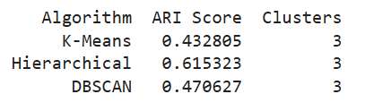

# 🌸 Iris Dataset Clustering

This project performs unsupervised clustering on the **Iris dataset** using:
- K-Means
- Hierarchical Clustering
- DBSCAN

Clustering results are evaluated using the **Adjusted Rand Index (ARI)**, and visualized using **PCA-reduced dimensions**.

---

## 📂 Project Structure

**Data Loading & Preparation**

**Feature Scaling**

**Exploratory Data Analysis**

**PCA (Principal Component Analysis)**

**Clustering Algorithms**

**Evaluation Metrics**

---

## 1. 📥 Load Data

- Dataset: `sklearn.datasets.load_iris()`
- Shape: `(150, 4)` features
- Target classes: `setosa`, `versicolor`, `virginica`

---

## 2. ⚙️ Feature Scaling

Used `StandardScaler` to standardize features for clustering and PCA:

```python
from sklearn.preprocessing import StandardScaler

scaler = StandardScaler()
X_scaled = scaler.fit_transform(X)
```
---

## 3. 📊 Exploratory Data Analysis (EDA)

Histograms of each feature using Plotly

Pairplot using Seaborn

Correlation heatmap

---

## 4. 📉 PCA (Principal Component Analysis)

Reduced the data to 2 components for visualization.

First 2 components explain ~95.8% of variance

```python
pca = PCA(n_components=2)
X_pca = pca.fit_transform(X_scaled)
```
---

## 5. 🤖 Clustering Algorithms
### 📌 K-Means

Optimal clusters determined using elbow method

Applied KMeans(n_clusters=3)

Visualized in PCA space

### 🧬 Hierarchical Clustering

Dendrogram plotted using scipy.cluster.hierarchy

Applied AgglomerativeClustering(n_clusters=3, linkage='ward')

### 🌐 DBSCAN

Optimal eps found using k-distance graph

Applied DBSCAN(eps=0.6, min_samples=5)

Identified outliers and arbitrary-shaped clusters

---

## 6. 🧪 Clustering Performance Evaluation

Evaluated with Adjusted Rand Index (ARI) using known labels.

  

📌 Highest ARI achieved with Hierarchical Clustering.

---

### 📷 Visualizations
K-Means Clustering (PCA)

Hierarchical Clustering (PCA)

DBSCAN Clustering (PCA)

---

### 🚀 Tools Used

Python

Pandas, NumPy, Matplotlib, Seaborn

Scikit-learn

Plotly

---

### 📌 Conclusion

Hierarchical clustering outperforms others on the Iris dataset (based on ARI).

PCA is helpful for visualization, but clustering is done on scaled full feature space.

DBSCAN shows promise with parameter tuning.
